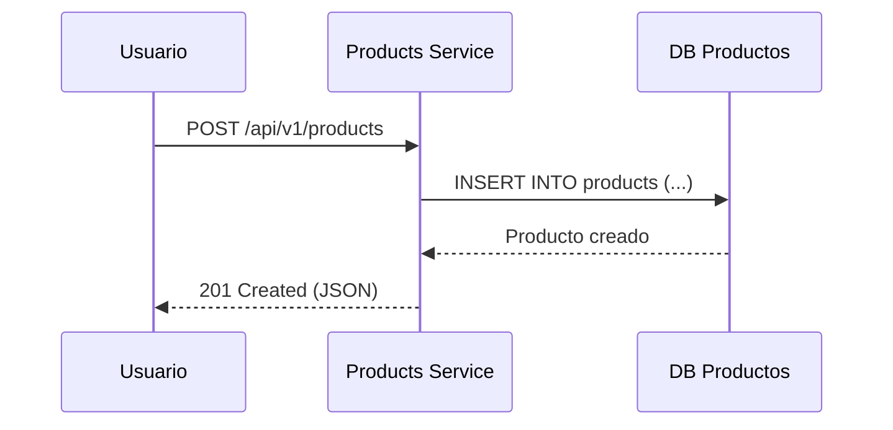
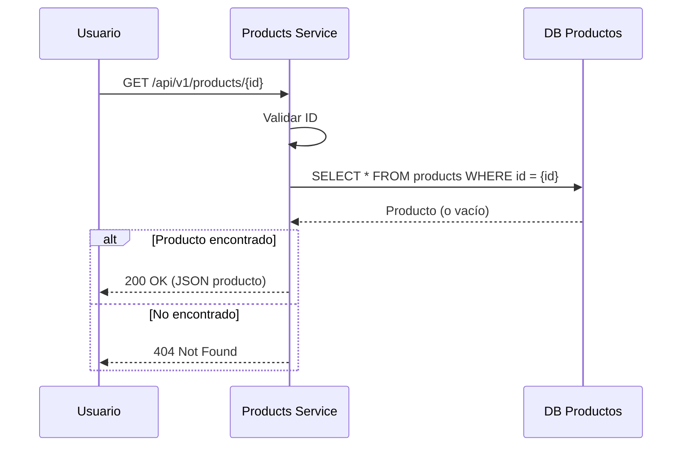
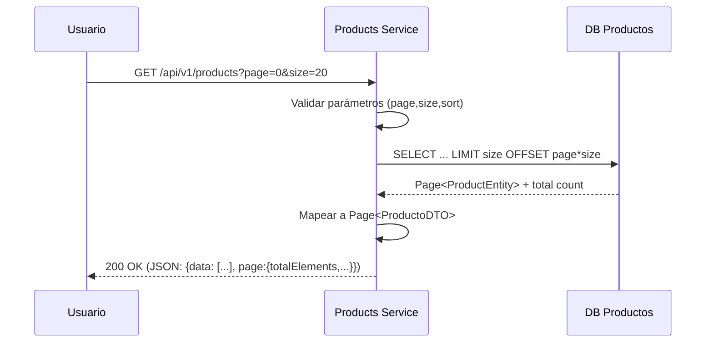
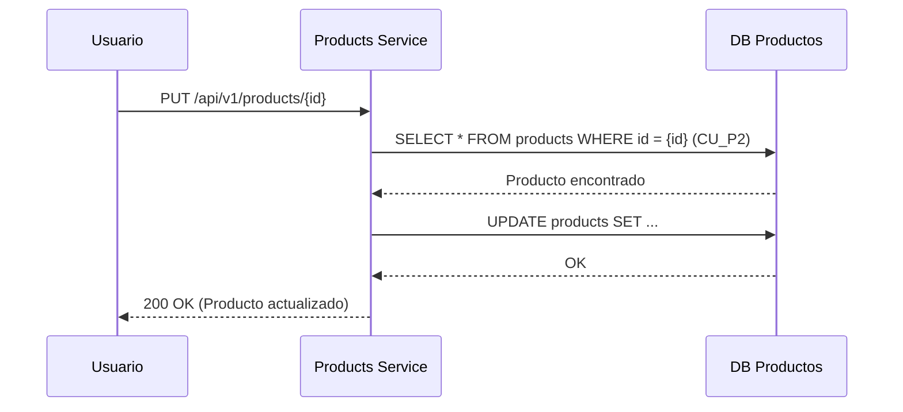
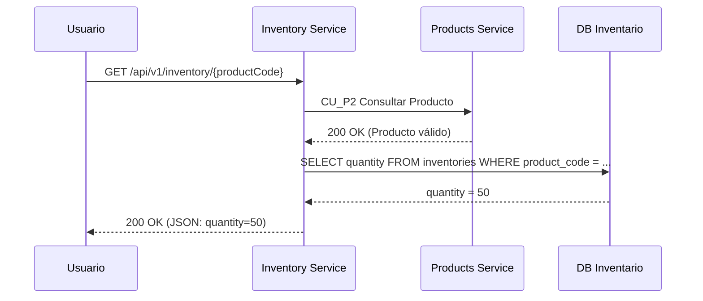
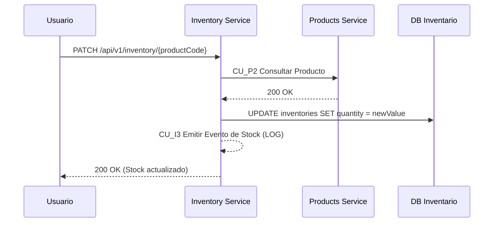

# 02_Flujo_Funcional

## 1. Propósito del documento
El propósito de este documento es describir los casos de uso funcionales y los flujos de interacción del sistema **Fullstack Products Inventory**, compuesto por dos microservicios:

- **Products Service**: Gestiona productos (CRUD).  
- **Inventory Service**: control de existencias y actualización de cantidades disponibles en inventario.

Este documento muestra cómo se comporta el sistema desde la perspectiva del usuario y de las interacciones entre servicios, sin entrar en detalles de implementación técnica.

---

## 2. Actores del sistema

| Actor | Descripción |
|--------|--------------|
| **Usuario (Frontend Angular)** | Interactúa con la aplicación para crear, consultar y modificar productos o inventarios. |
| **Products Service** | Expone endpoints REST para la gestión de productos. |
| **Inventory Service** | Expone endpoints REST para consultar y actualizar existencias, comunicándose con el servicio de productos cuando es necesario. |

---

## 3. Casos de uso funcionales

### **Microservicio de Productos**
| Código | Caso de uso | Descripción |
|:--|:--|:--|
| **CU_P1** | Crear Producto | Permite registrar un nuevo producto en el sistema. |
| **CU_P2** | Consultar Producto | Consulta los detalles de un producto específico. |
| **CU_P3** | Listar Productos | Obtiene una lista de productos con paginación. |
| **CU_P4** | Actualizar Producto | Modifica los datos de un producto existente. Incluye CU_P2 para validar existencia. |

### **Microservicio de Inventario**
| Código | Caso de uso | Descripción |
|:--|:--|:--|
| **CU_I1** | Consultar Stock | Obtiene la cantidad disponible de un producto. Incluye CU_P2 para validar el producto. |
| **CU_I2** | Actualizar Stock | Modifica la cantidad disponible tras una compra. Incluye CU_I3 para emitir evento de stock. |
| **CU_I3** | Emitir Evento de Stock | Registra un evento (log) al cambiar el stock. |

---

## 4. Diagrama general de casos de uso

**Interpretación:**
- Cada caso de uso se identifica con un código:
  - CU_Px: casos del microservicio de Productos.
  - CU_Ix: casos del microservicio de Inventario.

- Relaciones <<include>>:
   - CU_P4 (Actualizar Producto) incluye CU_P2 (Consultar Producto), ya que se debe obtener el producto antes de actualizarlo.
   - CU_I1 (Consultar Stock) incluye CU_P2 (Consultar Producto), dado que el inventario valida primero el producto.
   - CU_I2 (Actualizar Stock) incluye CU_I3 (Emitir Evento de Stock), porque cada actualización de inventario debe generar un log o evento.

- El actor principal sigue siendo el Usuario, quien interactúa a través del frontend Angular para realizar operaciones CRUD sobre productos y operaciones de stock.

---

## 5. Flujos funcionales detallados

### **CU_P1 – Crear Producto**
**Actor principal:** Usuario  
**Microservicio:** Products  
**Descripción:** Permite registrar un nuevo producto.  

**Flujo:**
1. El usuario envía la información del producto desde el frontend.  
2. El controlador REST (`POST /api/v1/products`) recibe la solicitud.  
3. Se valida la información y se crea la entidad `Product`.  
4. El servicio guarda el producto en la base de datos.  
5. Se devuelve una respuesta con el producto creado y su ID.

---

### **CU_P2 – Consultar Producto**
**Actor principal:** Usuario  
**Microservicio:** Products
**Descripción:** Recuperar los datos de un producto por su ID. Devuelve 404 si no existe. 

**Flujo:**
1. El usuario solicita el recurso (`GET /api/v1/products/{id}`).  
2. El controlador REST recibe la petición y valida el ID. 
3. El controlador delega en el servicio de aplicación para buscar el producto. 
4. El servicio consulta el repositorio (persistencia).
5. Si el producto existe, se transforma a DTO y se retorna `200 OK` con el recurso; si no existe, se retorna `404 Not Found`.  

---

### **CU_P3 – Listar Productos (paginación)**
**Actor principal:** Usuario  
**Microservicio:** Products  
**Descripción:** Obtener una lista paginada de productos. Parámetros típicos: page, size, sort. Retorna metadatos de paginación.  

**Flujo:**
1. El usuario solicita la lista con parámetros de paginación (`GET /api/v1/products?page=0&size=20`). 
2. El controlador valida y construye el objeto `Pageable`.
3. El servicio de aplicación invoca el repositorio con paginación.
4. El repositorio devuelve una página (`Page<ProductEntity>`).
5. El servicio mapea entidades a DTOs y devuelve `200 OK` con la página y metadatos (totalElements, totalPages, pageNumber, pageSize).

---

### **CU_P4 – Actualizar Producto (incluye CU_P2)**
**Actor principal:** Usuario  
**Microservicio:** Products    

**Flujo:**
1. El usuario envía los datos actualizados del producto (`PUT /api/v1/products/{id}`).
2. Se incluye CU_P2: el sistema consulta el producto para validar que exista.
3. Si existe, se actualizan los datos en la base.
4. Se devuelve la respuesta con el producto actualizado.

---
### **CU_I1 – Consultar Stock (incluye CU_P2)**
**Actor principal:** Usuario  
**Microservicio:** Inventory    

**Flujo:**
1. El usuario consulta el stock disponible (`GET /api/v1/inventory/{productCode}`).
2. Se incluye CU_P2: el servicio de inventario consulta al Products Service para validar el código.
3. Si el producto existe, obtiene la cantidad desde la base del inventario.
4. Retorna la cantidad disponible.

---
### **CU_I1 – Consultar Stock (incluye CU_P2)**
**Actor principal:** Usuario  
**Microservicio:** Inventory    

**Flujo:**
1. El usuario consulta el stock disponible (`GET /api/v1/inventory/{productCode}`).
2. Se incluye CU_P2: el servicio de inventario consulta al Products Service para validar el código.
3. Si el producto existe, obtiene la cantidad desde la base del inventario.
4. Retorna la cantidad disponible.

---
### **CU_I2 – Actualizar Stock (incluye CU_I3 y CU_P2)**
**Actor principal:** Usuario  
**Microservicio:** Inventory    

**Flujo:**
1. El usuario envía una solicitud de actualización (`PATCH /api/v1/inventory/{productCode}`).
2. SSe incluye CU_P2: se valida la existencia del producto llamando al Products Service.
3. Si el producto es válido, se actualiza la cantidad disponible.
4. Se incluye CU_I3: se emite un evento de stock (log).
5. Se devuelve una respuesta exitosa.
   

---

## 6. Resumen de casos de uso por microservicio

| Microservicio | Caso de uso | Descripción breve |
|----------------|--------------|-------------------|
| **Products** | Crear producto | Inserta un nuevo producto. |
| **Products** | Obtener producto por ID | Retorna un producto existente. |
| **Products** | Actualizar producto por ID | Modifica un producto existente. |
| **Products** | Eliminar producto por ID | Elimina un producto del sistema. |
| **Products** | Listar productos con paginación | Devuelve lista paginada de productos. |
| **Inventory** | Consultar cantidad | Devuelve stock actual de un producto. |
| **Inventory** | Actualizar cantidad | Modifica cantidad disponible tras compra. |
| **Inventory** | Emitir evento de cambio | Registra un log cuando cambia el stock. |
