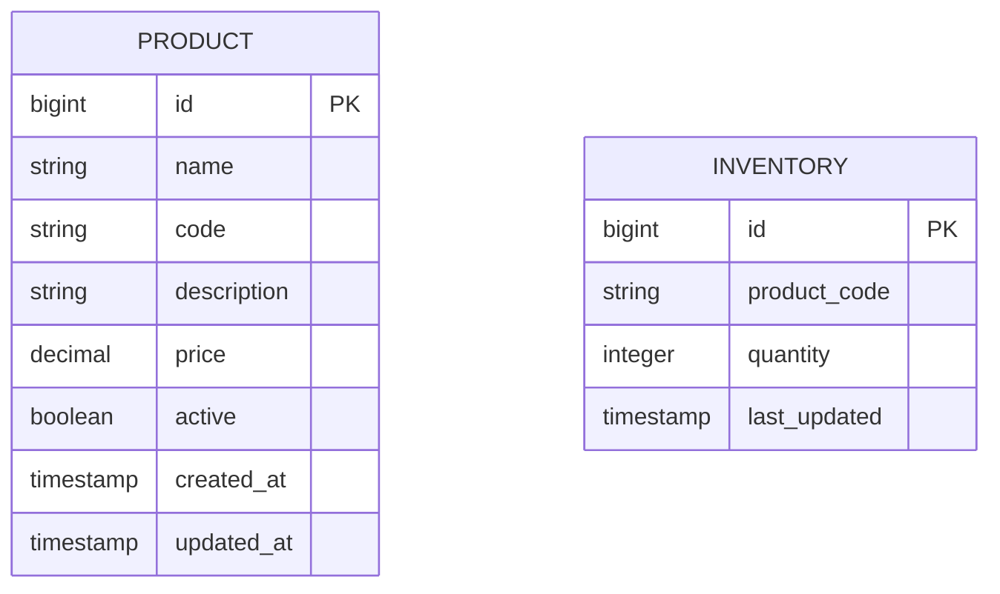
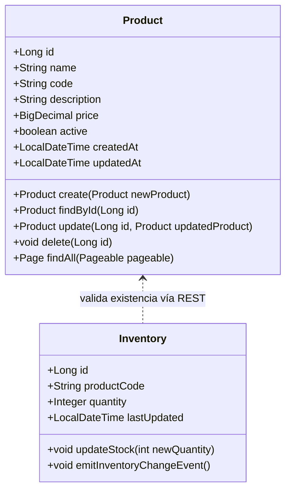

# 03_Modelo_Datos

## 1. Propósito del documento
Este documento describe el modelo de datos lógico y las entidades de dominio que forman parte del sistema **Fullstack Products Inventory**, compuesto por dos microservicios independientes:

- **Products Service**: administra la información de los productos.
- **Inventory Service**: gestiona las existencias de productos en inventario y se comunica con el servicio de productos para validar información.

Cada microservicio mantiene su propio modelo de datos y se comunica mediante llamadas REST, sin compartir tablas físicas.

---

## 2. SQL (PostgreSQL)
```sql
-- Tabla products
CREATE TABLE products (
  id BIGSERIAL PRIMARY KEY,
  name VARCHAR(150) NOT NULL,
  code VARCHAR(64) NOT NULL UNIQUE,
  description TEXT,
  price NUMERIC(15,2) NOT NULL,
  active BOOLEAN NOT NULL DEFAULT true,
  created_at TIMESTAMP WITHOUT TIME ZONE DEFAULT now() NOT NULL,
  updated_at TIMESTAMP WITHOUT TIME ZONE,
  version INTEGER DEFAULT 0
);

CREATE INDEX idx_products_code ON products(code);

-- Tabla inventories
CREATE TABLE inventories (
  id BIGSERIAL PRIMARY KEY,
  product_code VARCHAR(64) NOT NULL,
  quantity INTEGER NOT NULL DEFAULT 0 CHECK (quantity >= 0),
  last_updated TIMESTAMP WITHOUT TIME ZONE DEFAULT now() NOT NULL,
  version INTEGER DEFAULT 0
);

CREATE INDEX idx_inventories_product_code ON inventories(product_code);
```

---

## 3. Modelo Entidad–Relación



---

### Tablas detalladas

1. Entidad PRODUCT (Products Service)

| Campo | Tipo | Descripción | Obligatorio |
|---|---|---|:---:|
| id | BIGSERIAL / Long | Identificador (clave primaria, PK). | Sí |
| code | VARCHAR / String | Clave de negocio única del producto. | Sí |
| name | VARCHAR(150) / String | Nombre del producto. | Sí|
| description | TEXT / String | Descripción del producto. | No |
| price | NUMERIC(15,2) / BigDecimal | Precio del producto, con precisión decimal. Debe ser >= 0. | Sí |
| active | BOOLEAN / boolean | Indicador para activar/desactivar el producto. | Sí |
| created_at | TIMESTAMP / LocalDateTime | Fecha de creación del registro (Auditoría). | Sí |
| updated_at | TIMESTAMP / LocalDateTime | Fecha de la última modificación (Auditoría). | Sí |


2. Entidad INVENTORY (Inventory Service)


| Campo | Tipo | Descripción | Obligatorio |
|---|---|---|:---:|
| id | BIGSERIAL / Long | Identificador (clave primaria, PK). | Sí |
| product_code | VARCHAR / String | Referencia lógica a PRODUCT.code. Clave para consultar/actualizar el stock. | Sí |
| quantity | INTEGER / Integer | Cantidad de stock disponible. Debe ser >= 0. | Sí|
| last_updated | TIMESTAMP / LocalDateTime | Fecha y hora de la última modificación del nivel de inventario (Auditoría). | Sí |


## 4. Diagrama de clases de dominio
A nivel de código, cada microservicio define su propio conjunto de entidades de dominio.
El siguiente diagrama muestra su estructura en conjunto:


**Interpretación actualizada**

- **Product**
  - Define los atributos del recurso producto y los métodos CRUD esperados en el microservicio.
  - Los métodos create, findById, update, delete y findAll reflejan las operaciones del controlador REST del Products Service.
  - La paginación (findAll(Pageable pageable)) se maneja con Spring Data.

- **Inventory**
  - Contiene la información de existencias (quantity) por producto (productCode).
  - El método updateStock actualiza la cantidad disponible, y emitInventoryChangeEvent representa el evento/log cuando el inventario cambia.
  - El servicio de inventario valida la existencia del producto mediante una llamada REST al microservicio de productos antes de actualizar el stock.

## 5. Persistencia e infraestructura

### ProductEntity
```java
package com.example.products.infrastructure.entity;

import jakarta.persistence.*;
import org.springframework.data.annotation.CreatedDate;
import org.springframework.data.annotation.LastModifiedDate;
import org.springframework.data.jpa.domain.support.AuditingEntityListener;

import java.math.BigDecimal;
import java.time.LocalDateTime;

@Entity
@Table(name = "products", indexes = {
    @Index(name = "idx_products_code", columnList = "code", unique = true)
})
@EntityListeners(AuditingEntityListener.class)
public class ProductEntity {
    @Id
    @GeneratedValue(strategy = GenerationType.IDENTITY)
    private Long id;

    @Column(nullable = false, length = 150)
    private String name;

    @Column(nullable = false, length = 64, unique = true)
    private String code;

    @Column(length = 1000)
    private String description;

    @Column(nullable = false, precision = 15, scale = 2)
    private BigDecimal price;

    @Column(nullable = false)
    private boolean active = true;

    @CreatedDate
    @Column(nullable = false, updatable = false)
    private LocalDateTime createdAt;

    @LastModifiedDate
    private LocalDateTime updatedAt;

    // getters/setters
}
```

### InventoryEntity
```java
package com.example.inventory.infrastructure.entity;

import jakarta.persistence.*;
import jakarta.validation.constraints.Min;
import org.springframework.data.annotation.LastModifiedDate;
import org.springframework.data.jpa.domain.support.AuditingEntityListener;

import java.time.LocalDateTime;

@Entity
@Table(name = "inventories", indexes = {
    @Index(name = "idx_inventories_product_code", columnList = "product_code")
})
@EntityListeners(AuditingEntityListener.class)
public class InventoryEntity {
    @Id
    @GeneratedValue(strategy = GenerationType.IDENTITY)
    private Long id;

    @Column(name = "product_code", nullable = false, length = 64)
    private String productCode;

    @Min(0)
    @Column(nullable = false)
    private Integer quantity = 0;

    @LastModifiedDate
    @Column(nullable = false)
    private LocalDateTime lastUpdated;

    @Version
    private Integer version;

    // getters/setters
}
```